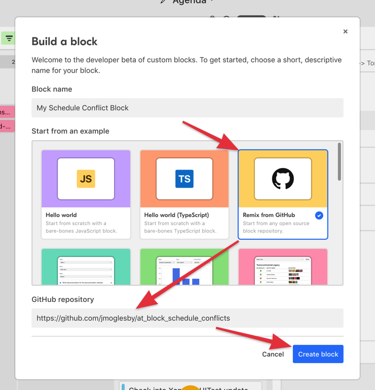

# Schedule Conflict block

When added to your base, this block will display scheduling conflicts created in the "Appointments"
table of your choice, and for the "People/Items" of your choice.

When scheduling large Programs with many individual events at different locations, and across
multiple days, it can be difficult to keep tabs on whether or not people have been double booked,
and scheduling conflicts can cause chaos.

This block is designed to help with that problem. It will check all events in the selected
"Appointments" table for instances where an individual "Person" or "Item" from the selected table
has been scheduled to be in two places at the same time!

For each person/item that has conflicting events/appointments/bookings scheduled, a section will be
displayed under their name with a list of any offending records, so that they can be expanded and
rescheduled.

## How to add this block to your base

1. Name your version of the block
2. Choose 'Remix from GitHub'in the 'Start from an example' section
3. Paste https://github.com/jmoglesby/at_block_schedule_conflicts as the GitHub repository
4. Click 'Create Block'
5. From there, follow [Airtable's SDK instructions](https://airtable.com/developers/blocks/guides/getting-started) to release the Block into your base

## See the block running

